

# 🚀 Talentium

### AI-Powered MERN Job Portal

  <b>Full-Stack Job Portal with AI Resume Parsing using Google Gemini API and AWS S3</b>

  
  
  
  

---

## 📌 Overview

Talentium is a production-grade MERN Stack Job Portal that connects **Candidates** and **Recruiters**.

### 👤 Candidate Features

- Candidate registration and login
- Profile creation and completion tracking
- Skills, education, experience, projects, and preferences
- AI-powered resume upload and auto-fill
- Job browsing and applications

### 🏢 Recruiter Features

- Recruiter registration and login
- Company profile management
- Job posting and status management
- Applicant review and hiring workflow

### 🤖 AI Features

- Resume upload in PDF/DOCX format
- AWS S3 storage
- Text extraction from resumes
- Google Gemini API integration
- Automatic headline and skills extraction

### 🔐 Security Features

- JWT access and refresh tokens
- HttpOnly cookies
- Role-based access control
- Helmet, HPP, Rate Limiting
- Joi validation

---

## 🛠️ Tech Stack

| Category       | Technologies                        |
| -------------- | ----------------------------------- |
| Frontend       | React.js, Vite, React Router, Axios |
| Backend        | Node.js, Express.js                 |
| Database       | MongoDB, Mongoose                   |
| Authentication | JWT, Refresh Tokens, Cookies        |
| Validation     | Joi                                 |
| AI             | Google Gemini API                   |
| File Storage   | AWS S3                              |
| Resume Parsing | PDF-Parse, Mammoth                  |
| Security       | Helmet, HPP, Rate Limiting, CORS    |
| Deployment     | Render, Vercel, MongoDB Atlas       |

---

# 🖼️ Screenshots

## 🏠 Landing Page

  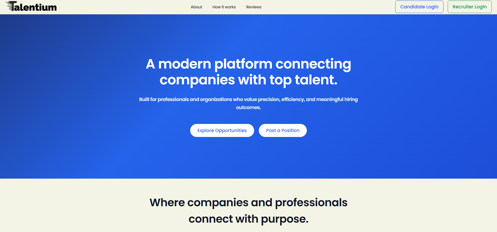

  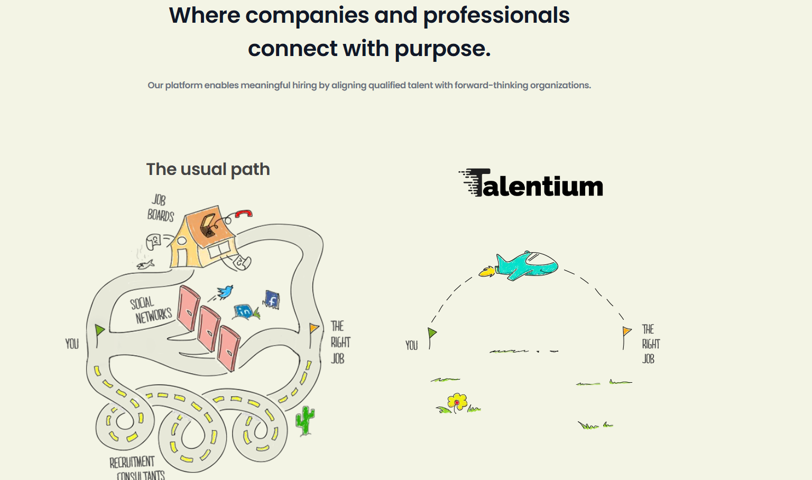

  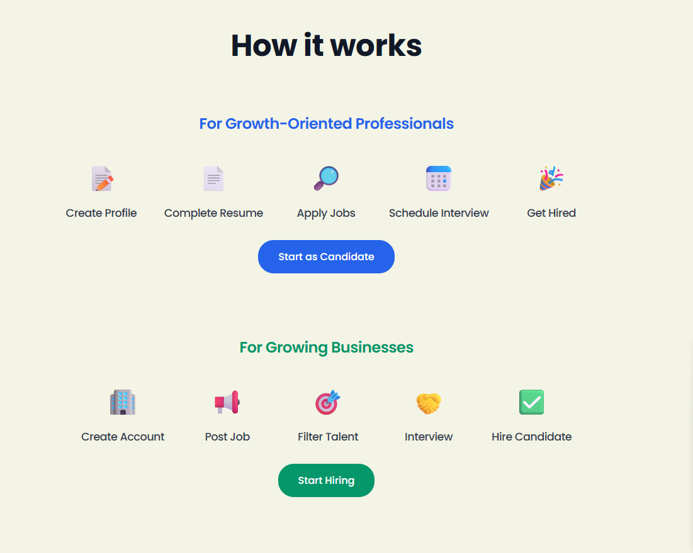

## 🔐 Login & Register

  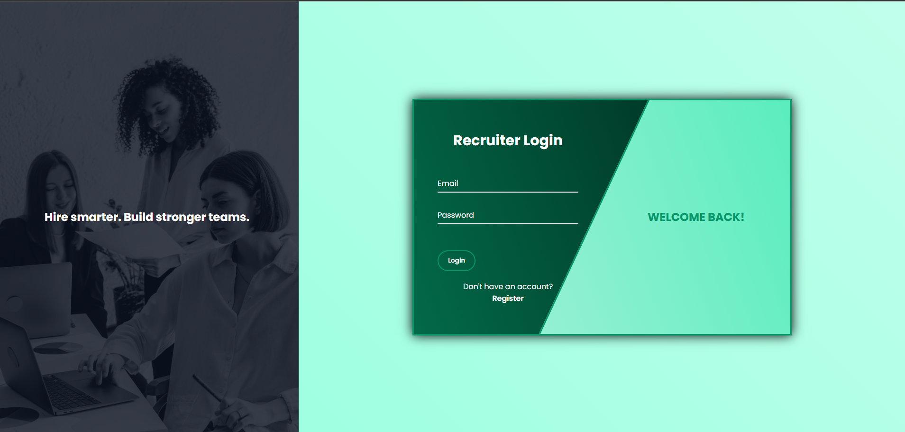
  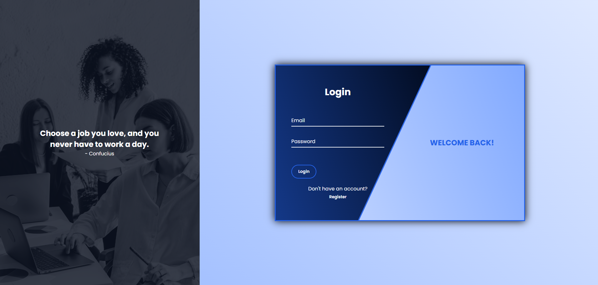

## 👤 Candidate Dashboard

  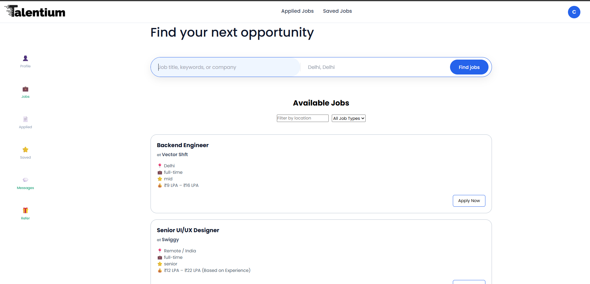
  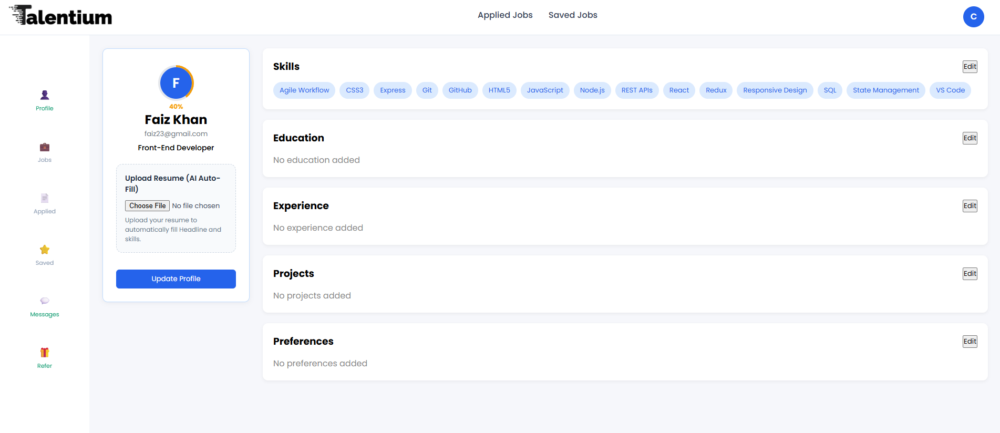
  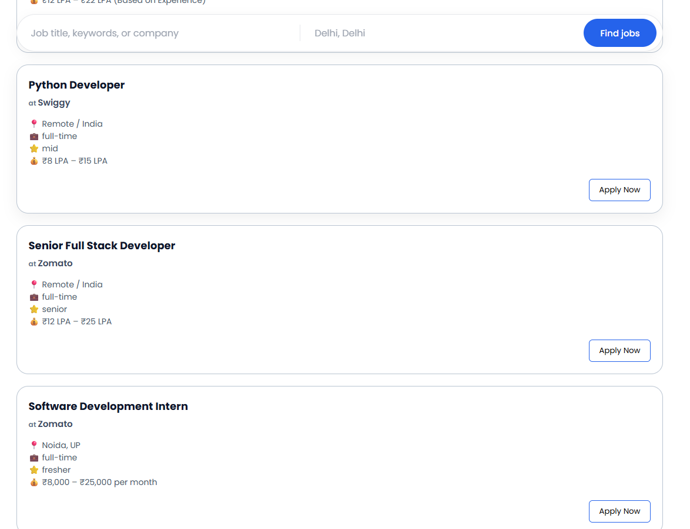

## 🏢 Recruiter Dashboard

  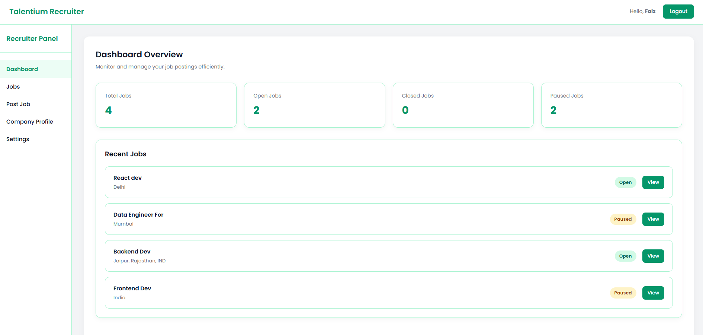
  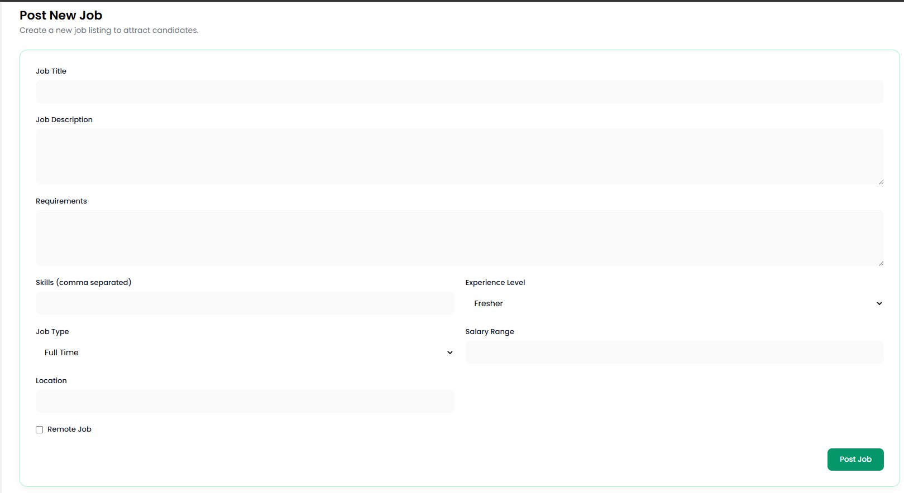
  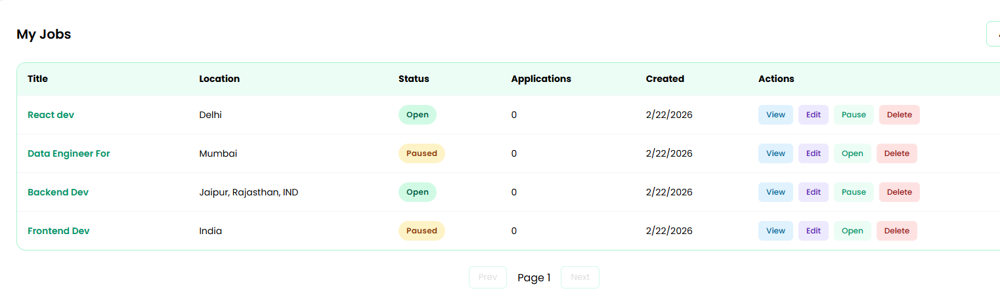
  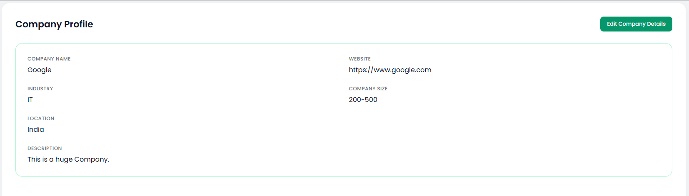

---

## 👨‍💻 Author

### Mohd Hammad Khan

**Full-Stack MERN Developer**

<a href="https://github.com/hammad2412">GitHub</a> •
<a href="https://www.linkedin.com/in/hammadkhan1224/">LinkedIn</a>

---

  <strong>⭐ If you like this project, consider giving it a star on GitHub! ⭐</strong>

